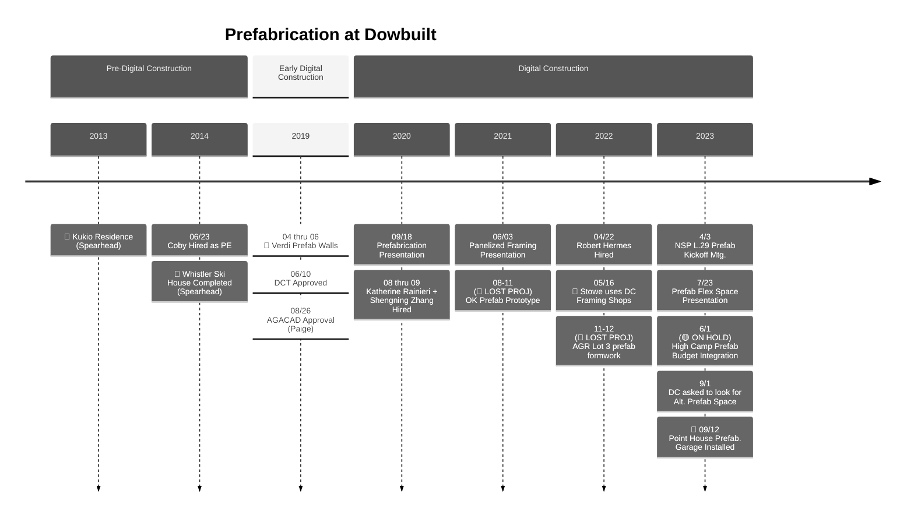

# Prefab @ Dowbuilt

- [04-06.2019 Verdi Prefab Walls](https://dowbuilt.egnyte.com/fl/yWNxDFkDzz)

- [09.18.2020 Prefabrication Presentation](https://docs.google.com/presentation/d/e/2PACX-1vSCiGv2cSQZE_HZJTHMKqD6QY7Bdx8pnNXrerADCyaJa7ZPNiaVfUKWhxYN7uW8jFlK0BERANA2c1Wt/pub?start=false&loop=false&delayms=3000)
- [06.03.2021 Panelized Framing Presentation](https://docs.google.com/presentation/d/e/2PACX-1vQJm_MYot9-AIkfohYMoEllTvqrpg-mqz7xhJEazROQm3UL1f5LnB6rio15Ubrk4SJPEhvv3WK6WiGi/pub?start=false&loop=false&delayms=3000)
- [05/16 Stowe Framing Shops](https://dowbuilt.egnyte.com/fl/dSHuSCnoOJ)

