# Prefab @ Dowbuilt


### Prefabrication Timeline

```
[KEY]
🔴: Dowbuilt Lost
🟡: On Hold
💎: Real Work put into Place
```




```mermaid
    %%{init: { 'logLevel': 'debug', 'theme': 'neutral', "graph": {"htmlLabels": true}} }%%
    timeline
        title Prefabrication at Dowbuilt
        section Pre-Digital Construction
          2013 : 💎 Kukio Residence (Spearhead)
          2014 : 06/23 <br> Coby Hired as PE : 💎 Whistler Ski House Completed (Spearhead)
        section Early Digital Construction
          2019 : 04 thru 06 <br> 💎 Verdi Prefab Walls : 06/10 <br> DCT Approved : 08/26 <br> AGACAD Approval (Paige)
        section Digital Construction
          2020 : 09/18 <br> Prefabrication Presentation : 08 thru 09 <br> Katherine Rainieri + Shengning Zhang Hired
          2021 : 06/03 <br> Panelized Framing Presentation : 08-11 <br> (🔴 LOST PROJ) <br> OK Prefab Prototype
          2022 : 04/22 <br> Robert Hermes Hired : 05/16 <br> 💎 Stowe uses DC Framing Shops : 11-12 <br> (🔴 LOST PROJ) <br> AGR Lot 3 prefab formwork : 09/05 <br> 💎 Snowflake Lodge <br> Modular Project Begins
          2023 : 4/3 <br> NSP L.29 Prefab Kickoff Mtg. : 7/23 <br> Prefab Flex Space Presentation : 6/1 <br> (🟡 ON HOLD)<br> High Camp Prefab Budget Integration : 9/1 <br> DC asked to look for Alt. Prefab Space : 💎 09/12 <br> Point House Prefab. Garage Installed : 12/16 <br> NSP/Weke Mtg. in Maui <br> Confirm prefab. approach : 12/23 <br> (🟡 ON HOLD) <br> K4 Framing Coord.
```

### Supporting Information

#### Precedents

- [04-06.2019 Verdi Prefab Walls](https://dowbuilt.egnyte.com/fl/yWNxDFkDzz)

- [09.18.2020 Prefabrication Presentation](https://docs.google.com/presentation/d/e/2PACX-1vSCiGv2cSQZE_HZJTHMKqD6QY7Bdx8pnNXrerADCyaJa7ZPNiaVfUKWhxYN7uW8jFlK0BERANA2c1Wt/pub?start=false&loop=false&delayms=3000)
- [06.03.2021 Panelized Framing Presentation](https://docs.google.com/presentation/d/e/2PACX-1vQJm_MYot9-AIkfohYMoEllTvqrpg-mqz7xhJEazROQm3UL1f5LnB6rio15Ubrk4SJPEhvv3WK6WiGi/pub?start=false&loop=false&delayms=3000)
- [07.23 Prefab Flex Space Presentation](https://docs.google.com/presentation/d/e/2PACX-1vTlTRJgbC-djhnJXEnexEnxZNj2I8S0RA3UAgHeCk6yHVYKId81kfogSByqADG4e_nKyRdd-tRRWMCo/pub?start=false&loop=false&delayms=3000)
- [05/16 Stowe Framing Shops](https://dowbuilt.egnyte.com/fl/dSHuSCnoOJ)

#### Project Management

- [Prefab Market Research](https://app.smartsheet.com/b/publish?EQBCT=31699345e756493680f8ed3340d139c6)
- [Prefab Space - Comps](https://app.smartsheet.com/b/publish?EQBCT=e6889654a2e04d249e142ab59a9b8afd)
- [NSP / Weke Prefab Estimate](https://app.smartsheet.com/sheets/FfwXhVW6q6wVPpvcQrQ2p5X7PpWhRH5f9H94W821)

