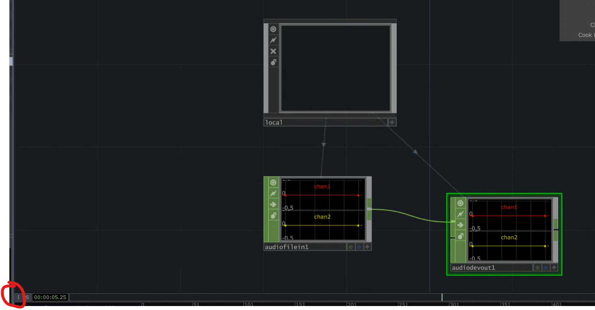

# TouchDesigner

### Index

[1] [User Interface](#[1] User Interface)

[2] [Operator Families](#[2] Operator Families)

[3] [Operators](#[3] Operators)

[4] [Saving and Folders](#[4] Saving and Folders)

[5] [Getting Help](#[5] Getting Help)

[6] [TOPs Part 1](#[6] TOPs Part 1)

[7] [Pixel Sortting](#[7] Pixel Sorting)

[8] [Widgets](#[8] Widgets)

[9] [TOPs Part 1](#[6] TOPs Part 1)

[10] [TOPs Part 1](#[6] TOPs Part 1)

[11] [Snippets](# [11] Snippets)

- [Chops Execute](#Chops Execute)
- [Ops Color Labels](# Ops Color Labels)
- [Stable Diffusion](# stable diffusion)

---

###  [1] User Interface
**Date:** 12.30.2023
**Reference:** [03 - The Interface - TouchDesinger Beginner Course](https://youtu.be/xtp1CLzWRUk?si=DxFfNGxHXel9ruHM)

#### Main UI Features

- Settings & Menus & Navigation Bar
  - File
  - Edit
  - Dialogs
  - Help
- Main Network Pane
- Timeline Settings
- Pallette

#### Toggle Navigation Panes

- Use pane layout features to add additional network panes that can change the view type with the drop down menus

#### Hierarchical Navigation System

- TouchDesigner files have a hierarchical system
- Use the 'Home' button to go to the root
- Press `U` to go one layer up
- Press `I` to go into the selected component/node (if has another layer within)

#### Timeliner

- Different timeline for each layer / component
- start, end = frames
- Rstart, Rend = range in which you are working in. (Blue timeline below main timeline)
- `space` = Pause

**[BACK TO INDEX](#Index)**

---

###  [2] Operator Families
**Date:** 12.31.2023
**Reference:** [04 - Operator Familes - TouchDesinger Beginner Course](https://youtu.be/oIFFuoeZMIE?si=DSvjPrU5cJXVC3ju)

#### Operator Family Basics

- to add new operator in four ways:
  - Click `+` button at top of main network pane
  - right click in main network pane and click `add operator`
  - Type `tab`
  - Double- click in main network pane
- Note: You can't connect one operator from one family to another. (But you can convert)

#### Operator Family Types

- **TOP** -> Texture Operators
  - 2D imagery, video, pixels.
  - Text
  - Render 3D Geometry
- **CHOP** -> Channel Operators
  - Data and signals
  - Audio
  - Random Number + Noise
  - LFO
  - Input Hardware
- **SOP** -> Surface Operators
  - 3D Geometry
- **MAT** -> Materials
  - Materials
  - Shaders
- **DAT** -> Data I/O
  - Text
  - Scripts
  - Structured Data
- **COMP** -> Components
  - 3D Object, Panels, Other, Dynamics
  - Animation, Engine, UI Tools,
  - `Base` component allows you to make other components
- **CUSTOM** -> Make your own

**[BACK TO INDEX](#Index)**

---

###  [3] Operators

**Date:** 12.31.2023.
**Reference:** [05 - Operators- TouchDesinger Beginner Course](https://youtu.be/OJl6n9an8hA?si=MBCdeFLvRg5hLi4g)

#### Operator Basics

- to parameters on/off with `P`
- `Right-click` on right end of operator to add a new connected one
- `Right-click` in the middle of connector to **add** or **insert**
- `H` for home, goes back to home view within operator visual or zoom-to-fit in main navigation pane.
- SOPS:
  - `W` wireframe mode
  - Right-click and then select `display options` to toggle other items on such as points
- DATS:
  - click on activate viewer `✦` in bottom right to activate editor, for IDE click in editor in parameters panel 

#### Operator Parameters

- Use the upper right concentric circle symbol to filter only modified parameters
- Wiki in upper left opens up browser
- to apply Python expression to parameter:
  - Click on left hand side of parameter of interest (should be + or -)
  - Click blue checkbox
  - Add python expression

**[BACK TO INDEX](#Index)**

---
###  [4] Saving and Folders

**Date:** 12.31.2023.
**Reference:** [06 – Saving and Folders – TouchDesigner Beginner Course](https://youtu.be/Y4JcjPjkL48?si=P6q1tznnv_t-zGmg)

#### Saving and Folders Basics

- Projects save with versioning 
- use `Create Project Folder` to help set up a project folder structure

#### Create Project Folder

- Create project folder can optionally create folders to store different assets.v

**[BACK TO INDEX](#Index)**

---
###  [5] Getting Help

**Date:** 12.31.2023.
**Reference:** [07 – Getting Help – TouchDesigner Beginner Course](https://youtu.be/wUAJpHhK9SM?si=dvCX6efH2S-GN5f4)

#### Getting Help Basics

- For overall help go to the `WIKI`, `FORUM`, or `TUTORIALS` buttons at top of navigation bar

- Useful Links:
  -  Wiki: [https://docs.derivative.ca/index.php?...](https://www.youtube.com/redirect?event=video_description&redir_token=QUFFLUhqa3RiMFhRSld3QWZIejVPNC1jOUhTVXdxQ3VpQXxBQ3Jtc0tuVC1fQXJvNWZoSE9jUzE0ZjVadmhwVUVwS3pBek9tVzlEdUc5MS1qcFRQTTVJcDkyMVR2UGx4bjJROTl0aWRRM3B2MElDVlE5NzFZbGwxRVJuQnJrVjAwRmJ1cVJ5YmZGMDBpQjgyNEdTMS1ObEd6bw&q=https%3A%2F%2Fdocs.derivative.ca%2Findex.php%3Ftitle%3DMain_Page&v=wUAJpHhK9SM) 
  - Forum: [https://forum.derivative.ca/](https://www.youtube.com/redirect?event=video_description&redir_token=QUFFLUhqa0xpWEZSLVBRaFREaG4tUUg5cmpycHRkeHV2QXxBQ3Jtc0traHFwajlSajc3eXFackpRS05XbkdPMVRiY1lJQnd6X0hxRERMOE5oSk9uVTdkRE1SUGZ2cWVxbU1FZVc3S2NVbi13WUVoc2FIQmp2QzlVTDRFeWk3SngyYXpabHc0dWNkTjc4ZmlleXB4UlBjM3paZw&q=https%3A%2F%2Fforum.derivative.ca%2F&v=wUAJpHhK9SM) 
  - Facebook Help Group: [  / touchdesignerhelp ](https://www.youtube.com/redirect?event=video_description&redir_token=QUFFLUhqbExOSjB0T3E2a0JsVmZOVks3MkNTYTkxWG5oZ3xBQ3Jtc0tsSWxBSGUxNm1JNXpQTDVBVHBuem5qRlVTWlZ6OW8xanZ5NkxfYnkwblV1ZHBDQThMR3lBNjZkd2ZfVmJaZ3RPWk5oYUkyUXN1YXF2VDJ4M3A5cFVfM0RMcUNTamxfSjduRHdhUzEwdWN1a1JBcFVtYw&q=https%3A%2F%2Fwww.facebook.com%2Fgroups%2FTouchDesignerHelp&v=wUAJpHhK9SM) 
  - Tutorials: [http://alltd.org/](https://www.youtube.com/redirect?event=video_description&redir_token=QUFFLUhqbUpLb29FVDZ6Z2gzYm5LdHZLYndRUWVhc3ZEQXxBQ3Jtc0trY01JYnR2VGw4OXJQRjBva2I4NEVJWXZTMDVsOHNjaG1XTTB3WWlpUlJWd1JXOE1PZnZ0a0Z2R1ZJdjFVaXRSbWoxeS1NSld2Vkcyc0FWUk5vUU9RVEFWazBVUzFFeWc3MnlCbHA2TkhoSzN5N1Yxbw&q=http%3A%2F%2Falltd.org%2F&v=wUAJpHhK9SM)
- Operator Snippets **(looks super useful)**
  - in navigation bar click `help` > `Operator Snippets`

- Specific Help for Nodes, click on `?` in paramter panel

  

- Error messaging click on red `X` on node to get error information

  
  
  

**[BACK TO INDEX](#Index)**

---
###  [6] TOPs Part 1

**Date:** 12.31.2023.
**Reference:** [08.01 – TOPs Part 1 – TouchDesigner Beginner Course](https://youtu.be/gVAPBqdUcgs?si=gljsoPx3EYRHcKgM)

#### TOPS Part 1 - Basics

- `Movie File In` - Node for movies , JPEGs or any texture based input.
  - Use the parameter panel to update the file path
  - Middle mouse click on Node's viewer window to get information about the image/video

#### Random Notes

- when in a node  you can hold down left mouse click on a parameter field to reveal additional settings such as numerical toggle

  

- Middle mouse click and drag left right now a parameter field to move like a slider.

  
  
  
  

**[BACK TO INDEX](#Index)**

---
###  [7] Pixel Sorting

**Date:** 01.04.2023.
**Reference:** [Pixel Sorting – TouchDesigner Tutorial 16](https://youtu.be/xasLIEw23zY?si=BhY3yJZRfM30ivl6)

#### Pixel Sorting Basics

- For overall help go to the `WIKI`, `FORUM`, or `TUTORIALS` buttons at top of navigation bar

**[BACK TO INDEX](#Index)**

---

###  [8] Widgets

**Date:** 01.07.2023.
**Reference:**

-  [Widgets Part 1: Introduction - Panel Layout and Fill Mode](https://youtu.be/Ty6pCyTIUyM?si=qmdTextdgaAfIGit)
- [Widgets Part 2: Widget COMP and Knob, Slider, and Button Layouts](https://youtu.be/v_JOu9ymKWg?si=bq1GbLisDoLN16Ya)
- [Widgets Part 4: Layouts Using Anchors for Proportional Sizing](https://youtu.be/iGOhqm_YHD8?si=JYWShl6khIB-Bfz9)

#### Widget Basics

- Parent Container

  - this is the outer container

  - in `parameters`->`layout` -> `size from window` -> ON

  - in `parameters`->`Panel`-> `Floating Viewer Aspect` -> Unconstrained

  - in `parameters`->`Children`-> configure Justification, Fit, Scale etc.

  - NOTE: you can right click on directory and open up parameters from there of any container.

    

- Child Container

  - in `parameters`->`look` -> `Background Color` -> Give It a Color / change alpha
  - Make another Container called `ui` 

**[BACK TO INDEX](#Index)**

---

###  [11] Snippets

**Date:** 01.07.2023.

#### Chops Execute

**Setup Note**: Note the chops exec operator requires a chops operator and a channel. in the channel parameter you can put `*` to accept any channel from that operator. In the CHOPS parameter of the chopexec operator you can put either `chop_operator_name` or `op('chop_operator_name')`

Ref: https://www.reddit.com/r/TouchDesigner/comments/196in5n/execute_chop_keyboard_in/

#### Ops Color Labels

To Activate: RMB on network background, choose Display/Color Palette (or hit c key)c

Reference: https://forum.derivative.ca/t/op-color-labels/2426

#### python snippets

- `tdu.rand(me.time.frame % 60 )` 
  - Random number between 0 and 1
  - in a constant.par.value0 parameter 
  - `me.time.frame % 60` = Seed Value
  - ref: ['Matthew Ragan - Make Some Noise 2/13'](https://youtu.be/bJopBD20rYs?si=DLiTRoqJd2SeiA3e&t=50)

#### stable diffusion

- install stable diffusion guide: https://stable-diffusion-art.com/install-windows/
- Automatic 1111 Github: https://github.com/AUTOMATIC1111/stable-diffusion-webui
- Seed Travel: https://github.com/yownas/seed_travel
  - Settings below
  - 
- Animaite with AI Seed Travel Youtube: https://youtu.be/MsO77hV121c?si=mpDqgY9pMvDjDJMT
  - Upscale '4x_foolhardy_Remacri' good for upscaling
  - Create prompts from images: https://huggingface.co/spaces/fffiloni/CLIP-Interrogator-2

#### TouchDesigner x StableDiffusion
- Tutorial https://youtu.be/4wpn_3JNaIc?si=rW0ZdnfikaHvdvMV
- How to create a base with independant time:
  - Create Base
  - Right click and press 'add Component time'
  - Go into base, then go into time and change the rate parameter to `cookRate()`
  - change tim play parameter to `0` so it stops playing
  - click `I` in bottom left hand screen for run independantly

https://youtu.be/4wpn_3JNaIc?si=XMMdIlGArha4Ou4m&t=1496 (24:56)
